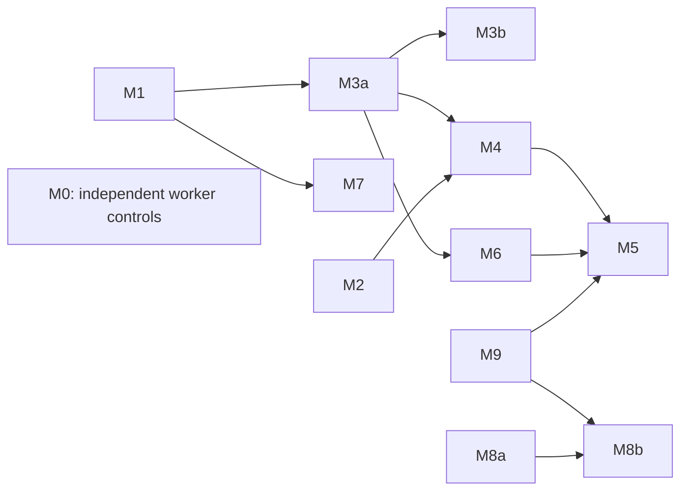

# Epic: Native multi-agent -- children, delegation envelope, single-agent handoff

**Epic** -- coordinating card governed by the [board contract](../../../developer/board_contract.md). Lane: `proposed/`.
Position established and reviewed on 2026-09-06; not accepted for implementation. This revision splits independent
capabilities and preserves the unresolved runtime probe gates.

**Origin**: supersedes [team_orchestration](../../retired/team_orchestration/card.md), retired on 2026-09-06 as
non-implementable. Its shipped team gates remain normative in `docs/design_workflows.md` §1.2. The old topology,
generated-instruction and termination proposals do not carry forward.

## Position

1. **Orchestration is vendor-owned.** Forge does not spawn or coordinate native subagents, teams, workflows or hosted
   rosters. It records locally observable evidence and controls supported delegation boundaries.
2. **One durable root per Forge session.** Native identifiers are bindings to that root. Evidenced native rollover can
   change a binding; `resume --fresh` and transfer-based `--resume-from` create a new Forge session with parent
   derivation. Native children are separate bindings under their owning session.
3. **Every handoff targets one main agent.** Explicit lossy strategies carry selected child evidence, never native
   teams, worker processes or full child transcripts.
4. **Read the append-only local record.** Retained pre-compaction evidence is input. Missing, truncated, encrypted or
   already-deleted material stays unavailable; append-only storage does not guarantee complete capture.
5. **Lossiness is deliberate.** Preserve observations, decisions, supported failed attempts and available task text. Do
   not reconstruct ciphertext or infer abandonment from a failed tool call alone.
6. **Lookup over carry.** Sources identify evidence and provide a runnable lineage search, including ancestor Forge
   roots.
7. **Effects over intent.** Existing supervision keeps its supported hook boundaries. Independent review uses
   Forge-owned fan-out; inherited native reviewer context cannot establish independence.
8. **Worker restrictions ship independently.** M0 explicitly disables native delegation and memory for Forge-owned
   workers. Managed roots retain their own delegation envelope and explicit memory choices.

## Evidence and runtime boundaries

The [appendix](#appendix-runtime-evidence) preserves exact paths, fields, controls and evidence status reviewed against
Claude Code 2.1.258 and Codex 0.153.4. It is not a claim that every live lifecycle was probed.

| Surface                      | Observable evidence                                                                           | Owner or boundary                                                                  |
| ---------------------------- | --------------------------------------------------------------------------------------------- | ---------------------------------------------------------------------------------- |
| Claude roots/subagents/teams | Transcripts, native joins, team config/tasks/inboxes and hook identifiers                     | M1 classifies conversation ownership; M3a captures and normalizes                  |
| Claude compaction            | Boundaries and summaries alongside retained earlier records                                   | M4 curates through the common reader; summaries are cross-checks                   |
| Codex roots/children         | Rollouts, thread/parent identifiers, agent paths and available calls/outputs                  | M3b captures and adapts; Codex parity does not block Claude member closeout        |
| Encrypted native items       | Availability metadata in captured records                                                     | Never reconstruct or classify solely by model name                                 |
| Responses hosted multi-agent | Hosted calls/results, agent attribution and client tool calls; some delegation text encrypted | No Forge adapter today; server execution does not imply no client-visible evidence |
| Claude Managed Agents        | Server events and thread-attributed client tool/permission requests                           | Separate server integration; no local Claude Code hooks                            |
| Codex cloud                  | Remote task outputs and review artifacts                                                      | Foreign producer, outside the member implementations                               |

The [Responses multi-agent guide](https://developers.openai.com/api/docs/guides/responses-multi-agent) and
[Managed Agents guide](https://platform.claude.com/docs/en/managed-agents/multiagent-orchestration) document distinct
hosted evidence surfaces.

## Forcing hazard

`resolve_session_name` in `src/forge/session/hooks/session_start.py` prioritizes inherited Forge names. A differing
startup UUID reaches a root binding write after a warning. `_capture_transcript_artifact` in
`src/forge/cli/hooks/commands.py` can similarly rebind at Stop and enqueue root work. A descendant resolving to the lead
manifest can therefore overwrite its binding and contaminate index/memory handoff. This is a code-established path;
live-team reproduction remains pending.

M1 must establish a reliable discriminator before child ownership ships. UUID mismatch alone is insufficient because
native forks legitimately report parent UUID at SessionStart and child UUID at Stop; missed SessionStart also matters.
This gate does not block independent M0 worker controls, M2 fidelity, M8a posture or M9 review work.

## Decisions and owners

- **D1 -- no orchestration surface.** No topology templates, generated team instructions, HTTP hook server or teammate
  termination. Supported native hooks and launch controls define the boundary.
- **D2 -- stable sources and nullable joins.** M3a owns the runtime-neutral source/coordinate/citation contract and
  Claude adapter. M1 owns Claude conversation classification; M3b owns Codex thread facts and adapter implementation.
  Missing spawning-turn joins never imply missing evidence.
- **D3 -- capture before cleanup.** M3a captures Claude children/teams independently of optional supervision. M3b
  captures Codex roots/children under the same immutable, bounded retention contract.
- **D4 -- explicit child strategies.** M5 owns `drop|result|curate|index`, placement, missing results and Sources.
- **D5 -- bounded curation.** M4 maps bounded windows and caches bounded reduction nodes. Cost follows changed windows
  and affected reduction nodes; no unbounded final reducer or tail-only guarantee.
- **D6 -- separate worker restrictions from policy.** M0 owns worker launch restrictions. M7 owns the managed-session
  per-call envelope, scoped activation and verified hook delivery. Counters/spend caps stay with
  [epic_budgeted_review_guards](../epic_budgeted_review_guards/card.md), Seam 5.
- **D7 -- separate posture from import.** M8a records emitted native-memory controls and launch posture. M8b captures
  opt-in provenance-tagged text after curation; Forge's memory writer does not ingest it.
- **D8 -- search precedes its invocation.** M6 owns root-qualified lineage query/results; M5 prints that shipped
  command. M4 uses M3a's citation formatter and does not wait for M6.
- **D9 -- review selects transfer bytes.** M9 owns the editable reviewed artifact, delivery selection, deferred launch
  and GC. It accepts existing transfer output and does not depend on M4. M5/M8b consume its contract.

## Members

Original ids remain recognizable; M3 and M8 have split suffixes, M0 is the early worker card, and M9 owns D9.

| Id  | Card                                                                      | Independently shippable outcome                                  | Depends on          |
| --- | ------------------------------------------------------------------------- | ---------------------------------------------------------------- | ------------------- |
| M0  | [worker_native_controls](../worker_native_controls/card.md)               | Worker-only native delegation and memory restrictions            | --                  |
| M1  | [child_conversation_identity](../child_conversation_identity/card.md)     | Probed Claude root/child lifecycle ownership                     | --                  |
| M2  | [transfer_summarizer_fidelity](../transfer_summarizer_fidelity/card.md)   | Block-list results and delegation descriptions retained          | --                  |
| M3a | [child_transcript_snapshots](../child_transcript_snapshots/card.md)       | Common reader/citations, Claude child/team capture               | M1                  |
| M3b | [codex_source_adapter](../codex_source_adapter/card.md)                   | Codex capture, adapter and basic Codex-as-source launch          | M3a                 |
| M4  | [windowed_incremental_curation](../windowed_incremental_curation/card.md) | Bounded cached curation with Claude-source acceptance            | M2, M3a             |
| M5  | [child_transfer_strategies](../child_transfer_strategies/card.md)         | Child strategy matrix and Sources with Claude-source acceptance  | M2, M3a, M4, M6, M9 |
| M6  | [lineage_search_retrofit](../lineage_search_retrofit/card.md)             | Cross-root lineage search for Claude/team/handoff sources        | M3a                 |
| M7  | [delegation_envelope_policy](../delegation_envelope_policy/card.md)       | Managed-session delegation envelope and verified delivery        | M1                  |
| M8a | [native_memory_explicit](../native_memory_explicit/card.md)               | Main-session memory intent, controls and per-run posture         | --                  |
| M8b | [native_memory_import](../native_memory_import/card.md)                   | Bounded native-memory import through reviewed transfer selection | M8a, M9             |
| M9  | [reviewed_launch_artifact](../reviewed_launch_artifact/card.md)           | Reviewed transfer selection, delivery, deferred resume and GC    | --                  |

[team_supervisor_plan_context](../team_supervisor_plan_context/card.md) remains adjacent and owns its Codex lane; it
does not gate capture.

## Dependency graph and execution

Branch base: `main`. Integration owner: the epic owner for shared docs, contract changes and integrated acceptance.
Dependencies above are feature requirements; touching a shared file is an ownership/scheduling constraint, not a reason
to make unrelated features prerequisites.

M0, M1, M2, M8a and M9 are initially ready. After M3a, M4 and M6 can proceed independently, while M3b implements the
Codex adapter. M3b does not gate Claude curation, search or child-strategy closeout. M8b does not wait for M4/M5. The
graph omits redundant transitive edges; the member table lists required contracts.

Per-card branches and merges are the default. These optional shared batches replace the previous A-to-D barrier chain:

| Batch | Fixed members/order | Parallel or sequential boundary                                                                                          |
| ----- | ------------------- | ------------------------------------------------------------------------------------------------------------------------ |
| A     | M0, M1, M2          | Parallel only across disjoint worker-control, identity-hook and summarizer writes/tests; one integrator owns shared docs |
| C     | M4 then M5          | Sequential, one branch owner for transfer module/schema; M6 and M9 must be integrated before M5 begins                   |

M3a, M3b, M6, M7, M8a, M8b and M9 use per-card PRs. M0 may also merge independently as soon as verified; choosing a
shared A branch instead means waiting for every included card, including M1's probe. No batch bundles M3a with M3b.

Shared launcher/config/model edits among M1/M8a/M9/M3b, Codex-hook edits among M3b/M7, and adapter-registration edits
must be sequenced under one owner when their actual write/test scopes overlap. Do not claim parallel execution across
those boundaries. The epic owner records that edit ownership before activation; other disjoint work may proceed.

Each card retains its own checklist, commit series, evidence and closeout. Shared batches merge only when every included
member is complete, after aggregate unit, regression, pre-commit and board/link checks on the integrated head. Changing
a shared batch's membership/order requires updating its authorization before execution.

## Codex parity closeout

Codex remains required for epic v1. M4/M5/M6 close on their explicit Claude scopes; M9 and M8b verify existing
Claude-source paths to supported destinations. M3b closes on capture/adapter and basic source-launch acceptance. None
carries unpassed mandatory rows for a feature that has not shipped yet.

The **epic integrator owns the following cross-feature acceptance**, including fixture additions, execution evidence and
end-user support claims. Run each gate after its prerequisites land; no earlier member is held open for it.

| Gate                           | Prerequisites | Required integrated evidence                                                                                                                                     | Existing test homes                                                                                |
| ------------------------------ | ------------- | ---------------------------------------------------------------------------------------------------------------------------------------------------------------- | -------------------------------------------------------------------------------------------------- |
| P1: Codex curation             | M3b, M4       | Raw pre-compaction evidence and truncated-tail ordinal mapping reach bounded maps; ciphertext stays unavailable; cache/citations resolve                         | `tests/src/session/test_transfer.py`, `tests/integration/cli/test_artifact_hooks_integration.py`   |
| P2: Codex child strategies     | M3b, M5       | All applicable strategies handle returned/missing/running/unjoined children without copied-prefix duplication, with source-qualified placement                   | `tests/src/session/test_transfer.py`, `tests/src/cli/test_session_derivation.py`                   |
| P3: Codex lineage search       | M3b, M6       | Root/child rollout plaintext is searchable across explicit ancestor roots; inherited/ciphertext items excluded; coverage and anchors correct                     | `tests/src/search/test_extractor.py`, `tests/integration/cli/test_search_workflow_integration.py`  |
| P4: Codex-source review/import | M3b, M9, M8b  | Both destination runtimes receive selected reviewed bytes from a Codex source; imported native memory uses parent context and survives deferred launch unchanged | `tests/src/session/test_codex_handoff.py`, `tests/integration/core/test_claude_to_codex_resume.py` |

These gates verify the composed outcome; they do not hide unassigned implementation. If a gate finds missing work,
record a new explicit follow-up member before implementation and keep the epic open until it ships. Until a runtime path
is verified, guides/status must describe actual supported coverage rather than advertise full native-multiagent parity.
The epic cannot close with any P1-P4 gate outstanding.

## Shared-contract seams

- **M3a:** source ids, immutable versions, retained coverage, original coordinates, normalized reader and citation
  formatter. M3b is an adapter; M4/M5/M6 never parse native Codex record shapes themselves.
- **Ownership:** M1 owns hook-written Claude conversation children; M3a owns in-process Claude entries; M3b owns
  CLI-written Codex children and receipt-only hooks.
- **M6 command:** `forge search query "<terms>" --lineage <session> --lineage-root <absolute-forge-root> --json`. M5
  shell-quotes source-parent/root values so frozen handoffs work from receiving worktrees.
- **Assembly:** M4 curates, M5 selects/renders child evidence, M8b appends imported data, and M9 selects the reviewed
  transfer payload. Each works with existing output when the other optional producers have not shipped.
- **Launch controls:** M0 is worker-only; M8a shapes main-session memory posture; M7 shapes the managed envelope. Shared
  helpers receive explicit scope and preserve the other controls.
- **Normative sync:** proposed contracts stay in these cards until shipped. Member sync lists are closeout obligations;
  the retired sketch's shipped workflow behavior remains normative now.

## Probe gates

1. **M1:** live lead/teammate/background-copy/native-fork payloads across startup, resume, compact/clear, StopFailure
   and missed SessionStart. Pin positive root-transition and descendant evidence.
2. **M3a:** live team-hook origin and last reliable capture before cleanup. **M3b:** enrolled/unenrolled discovery,
   rollout fields and prefix mapping. Neither may promise unseen abrupt-exit evidence.
3. **M0:** worker-native admission/control verification, including fork-context skills, independent of policy
   enrollment. **M7:** native spawn/resume names, effective background/isolation and actual enrolled hook delivery.
4. Native fork copying of `subagents/` remains an observation question; source identity must prevent duplicate carry
   either way. Encryption availability is read from actual records, not inferred from model identity.

## Appendix: Runtime evidence

Reviewed on **2026-09-06**, against **Claude Code 2.1.258** and **Codex 0.153.4**. `Documented` means upstream
documentation; `source/sample review` preserves the earlier review's reported findings, not a new live probe. Unretained
samples must become redacted versioned fixtures before an implementation relies on their exact serialization. Live
lifecycle questions remain in the probe gates above.

| Runtime        | Concrete baseline to re-verify                                                                                                        | Evidence and implementation consequence                                                                                                                                                                    |
| -------------- | ------------------------------------------------------------------------------------------------------------------------------------- | ---------------------------------------------------------------------------------------------------------------------------------------------------------------------------------------------------------- |
| Claude 2.1.258 | `~/.claude/projects/<project>/<session>/subagents/agent-<id>.jsonl`                                                                   | Documented path; native home overrides must be resolved, not hard-coded                                                                                                                                    |
| Claude 2.1.258 | Sibling metadata: `agentType`, `description`, `toolUseId`, `spawnDepth`                                                               | Source/sample review; `toolUseId` joined one sampled parent `tool_use.id`; retain a fixture and validate missing/ambiguous joins                                                                           |
| Claude 2.1.258 | `cleanupPeriodDays`, default 30 days                                                                                                  | Documented retention sweep; it is not a guarantee that Forge captured the last record                                                                                                                      |
| Claude 2.1.258 | `~/.claude/teams/<team-name>/config.json`, `inboxes/<agent-name>.json`; `~/.claude/tasks/<team-name>/`                                | Documented: team name `session-<lead-id-first8>`; config/inboxes removed at session end, tasks persist under retention                                                                                     |
| Claude 2.1.258 | Team config `members` contains name/agent id; lead type `team-lead`                                                                   | Documented membership inventory; joining that id to hook conversation identity still needs M1's live probe                                                                                                 |
| Claude 2.1.258 | `TaskCompleted.task_id`, `task_subject`; optional deprecated `team_name`                                                              | Documented payload; no established `task_name` replacement                                                                                                                                                 |
| Claude 2.1.258 | `compact_boundary` and plaintext `isCompactSummary` with earlier records retained                                                     | Source/sample review; retain original records and map summary placement without replacing evidence                                                                                                         |
| Claude 2.1.258 | `-p` excludes teammates but ordinary subagents remain; `CLAUDE_CODE_FORK_SUBAGENT=1` can enable headless forks                        | Documented controls; M0 also restricts native tools, teams/workflows and memory                                                                                                                            |
| Codex 0.153.4  | Rollout thread source `subagent`; reviewed fields `thread_source`, `parent_thread_id`, `agent_path`, `subagent_history_start_ordinal` | Source/sample review; pin actual serialized nesting and ordinal-to-record mapping in M3b fixtures                                                                                                          |
| Codex 0.153.4  | Sampled child copied parent history; native history ordinal differed from physical JSONL record index                                 | Reported local sample, not a general line-offset rule; map before retention/prefix exclusion                                                                                                               |
| Codex 0.153.4  | MultiAgentV2 encrypts delegation text/reasoning; available calls/outputs remain usable                                                | Source review, [PR #26210](https://github.com/openai/codex/pull/26210) and [issue #28058](https://github.com/openai/codex/issues/28058); preserve plaintext historical items and label actual availability |
| Codex 0.153.4  | `compacted` rollout record; replacement-history `compaction` item may be encrypted                                                    | Source/sample review; retained pre-compaction records are the evidence, not reconstructed ciphertext                                                                                                       |
| Codex 0.153.4  | `agents.enabled=false`; `memories.use_memories=false`; `memories.generate_memories=false`                                             | Documented launch controls; emitted settings and observed behavior are separate facts                                                                                                                      |

Sources: [Claude subagent persistence](https://code.claude.com/docs/en/sub-agents#resume-subagents),
[team architecture](https://code.claude.com/docs/en/agent-teams#architecture),
[TaskCompleted payload](https://code.claude.com/docs/en/hooks#taskcompleted-input),
[fork controls](https://code.claude.com/docs/en/sub-agents#turn-fork-mode-on-or-off),
[workflow controls](https://code.claude.com/docs/en/workflows#turn-workflows-off),
[Codex configuration](https://learn.chatgpt.com/docs/config-file/config-reference) and
[hook trust](https://learn.chatgpt.com/docs/hooks).

## Out of scope and adjacent

- Advisor/proxy server-tool compatibility and consultation activity need a separate card; transport behavior stays
  outside these members.
- Server-side sessions retain adopt-or-gate treatment. Foreign producer changes may pass through
  `forge workflow panel --check`; Responses event capture or Managed Agents permission brokering needs its own adapter.
- Team-supervisor Codex lane remains with `team_supervisor_plan_context`.

## Closeout

All twelve live members and any accepted follow-ups are `done/`, required probes and P1-P4 pass, and design/end-user
docs describe the shipped runtime coverage. Evidence includes stable lead identity, retained child sources, cross-root
retrieval, selected reviewed transfer delivery and verified worker controls. No unresolved probe or Codex parity gate
can be relabeled as completed implementation.
