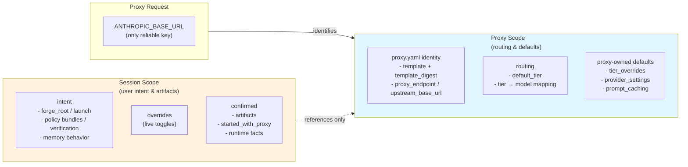
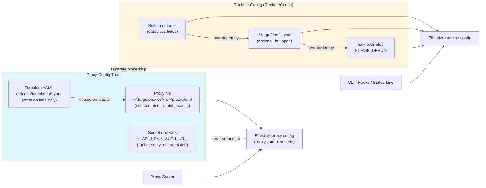
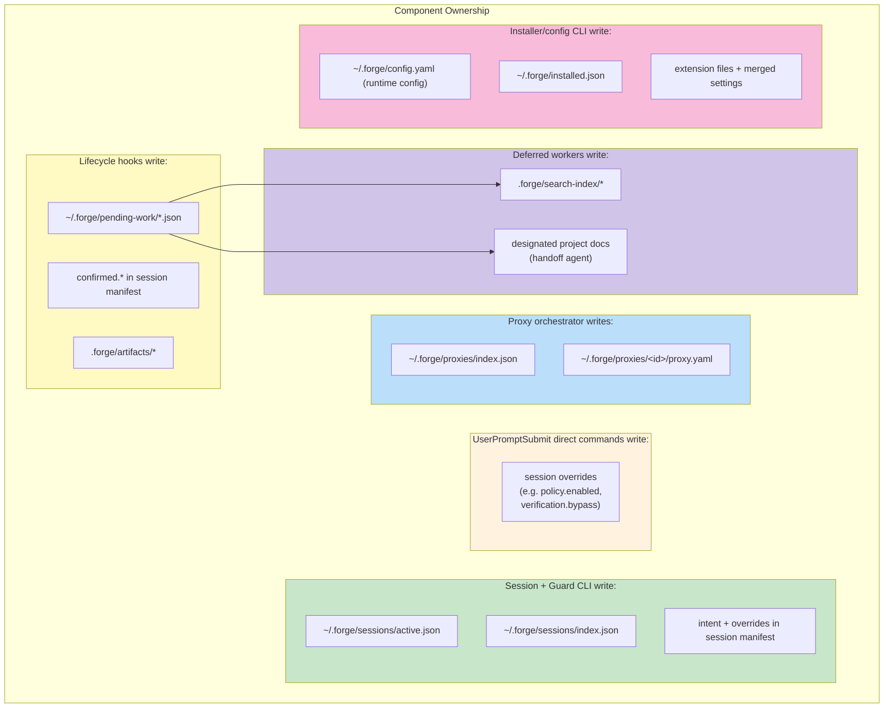
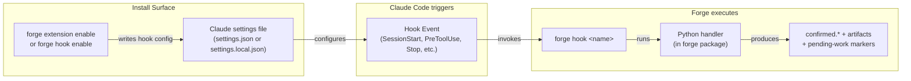
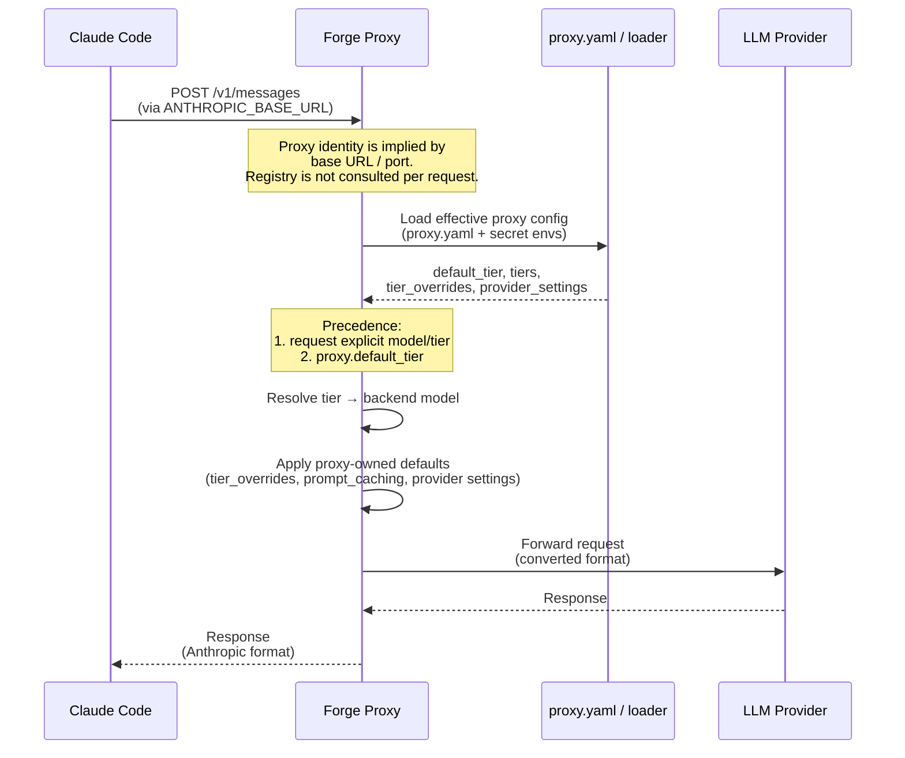
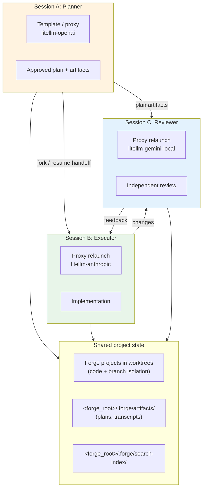
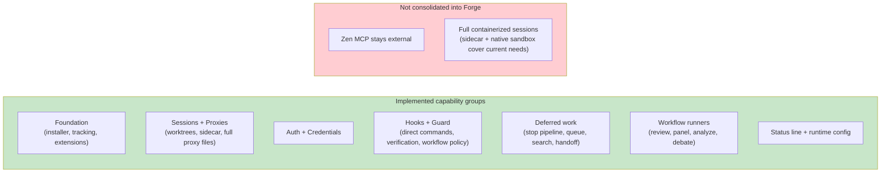
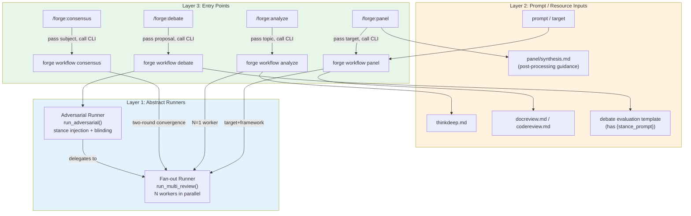
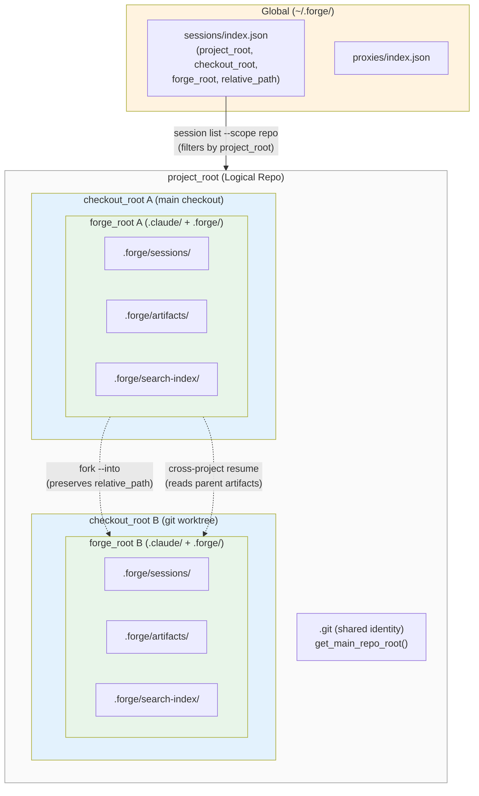

# Forge Architecture Diagrams

Visual representations of the Forge unified architecture.

---

## 1. Core Architecture Overview

```mermaid
flowchart TB
    subgraph UserLayer["User Layer"]
        CLI["forge CLI"]
        CC["Claude Code"]
    end

    subgraph StateLayer["State + Artifacts"]
        RC["~/.forge/config.yaml<br/>(runtime config)"]
        ASP["~/.forge/sessions/active.json<br/>(runtime live-session registry)"]
        SM["&lt;forge_root&gt;/.forge/sessions/&lt;name&gt;/forge.session.json<br/>(session manifest)"]
        SI["~/.forge/sessions/index.json<br/>(session index)"]
        PR["~/.forge/proxies/index.json<br/>(proxy registry)"]
        WQ["~/.forge/pending-work/*.json<br/>(deferred work markers)"]
        ART["&lt;forge_root&gt;/.forge/artifacts/<br/>(plans, transcripts)"]
        SEARCH["&lt;forge_root&gt;/.forge/search-index/<br/>(search stores)"]
    end

    subgraph Components["Forge Components"]
        Session["Session CLI<br/>(lifecycle + overrides)"]
        Orchestrator["Proxy Orchestrator<br/>(create/start/stop)"]
        Proxy["Proxy Server<br/>(routing + translation)"]
        Sidecar["Sidecar Runtime<br/>(Docker proxy + Claude)"]
        Hooks["Hooks<br/>(confirmed facts + artifacts)"]
        Queue["Work Queue Processor<br/>(CLI startup)"]
        SearchIdx["Search Indexer"]
        Handoff["Handoff Agent<br/>(background doc updates)"]
        Status["Status Line"]
    end

    subgraph External["External Services"]
        Anthropic["Anthropic API"]
        LiteLLM["LiteLLM<br/>(TR/Local)"]
    end

    CLI --> Session
    CLI --> Orchestrator
    CLI -->|non-hook startup| Queue
    CLI -->|host mode| Proxy
    CLI -->|sidecar mode| Sidecar
    CC -->|ANTHROPIC_BASE_URL| Proxy
    CC -->|hook events| Hooks

    Session -->|writes| ASP
    Session -->|writes intent/overrides| SM
    Session -->|writes| SI
    Hooks -->|writes confirmed.*| SM
    Hooks -->|copies plans/transcripts| ART
    Hooks -->|enqueues stop/index/handoff| WQ
    Queue -->|reads markers| WQ
    Queue --> SearchIdx
    Queue --> Handoff
    SearchIdx -->|writes| SEARCH
    Orchestrator -->|writes| PR

    Status -->|reads| RC
    Status -->|reads| SM
    Status -->|reads| PR
    Status -->|GET /| Proxy

    Proxy -->|routes to| LiteLLM
    Proxy -->|routes to| Anthropic
```

---

## 2. Session vs Proxy Separation

This is the fundamental architectural principle: proxy requests lack stable session IDs, so routing must be
proxy-scoped.

---

## 3. Configuration Model

Two independent config tracks — proxy routing and runtime preferences never mix.

**Proxy track**: `proxy.yaml` is self-contained at runtime; templates are copied only when the proxy is created, and
secret env vars are read without being written back into the file. **Runtime track**: `RuntimeConfig` resolves built-in
defaults -> `~/.forge/config.yaml` -> env overrides. Separate modules prevent runtime preferences from leaking into
proxy routing.

---

## 4. Ownership Boundaries

**Guard split:** `forge guard enable/disable` mutates `intent.policy`; the policy-check hook writes `confirmed.policy`;
and `%guard ...` direct commands mutate session overrides.

---

## 5. Hook Deployment Model

---

## 6. Proxy Routing Flow

---

## 7. Multi-Proxy Workflow

The core use case motivating Session/Proxy separation:

When a child session must target a specific running proxy instance, switch to that session and use
`forge claude start --proxy <proxy_id>`.

---

## 8. Implementation Status

---

## 9. Workflow Runner Architecture

Runner-backed workflows currently have two entry surfaces: CLI commands, and skills that compose prompts/resources and
then call those CLIs.

**Key relationships:**

- `forge workflow analyze` is a specialized fan-out with one worker and a bundled resource
- `forge workflow debate` layers stance injection and blinding on top of fan-out
- `forge workflow consensus` runs two fan-out rounds (evaluate, then reconcile)
- `/forge:panel`, `/forge:analyze`, `/forge:debate`, and `/forge:consensus` prepare prompts/resources and then call the
  corresponding CLI entry point
- `/forge:review` and `/forge:review-docs` are local review skills; their optional multi-model path uses
  `forge workflow panel`

---

## 10. Project Identity Hierarchy

Four scoping levels that determine where session state, artifacts, and search indexes live. See
[design.md §3: Project identity model](design.md#project-identity-model) for normative rules.

**Key relationships:**

- Each Forge project (`forge_root`) is self-contained: sessions, artifacts, and search live under its `.forge/`
- Cross-project operations (fork, resume) are allowed within the same logical repo (`project_root`)
- `session list` defaults to repo scope (shows sessions across all Forge projects in the logical repo)
- `relative_path` = `forge_root` relative to `checkout_root`; preserved when forking `--into` another worktree
